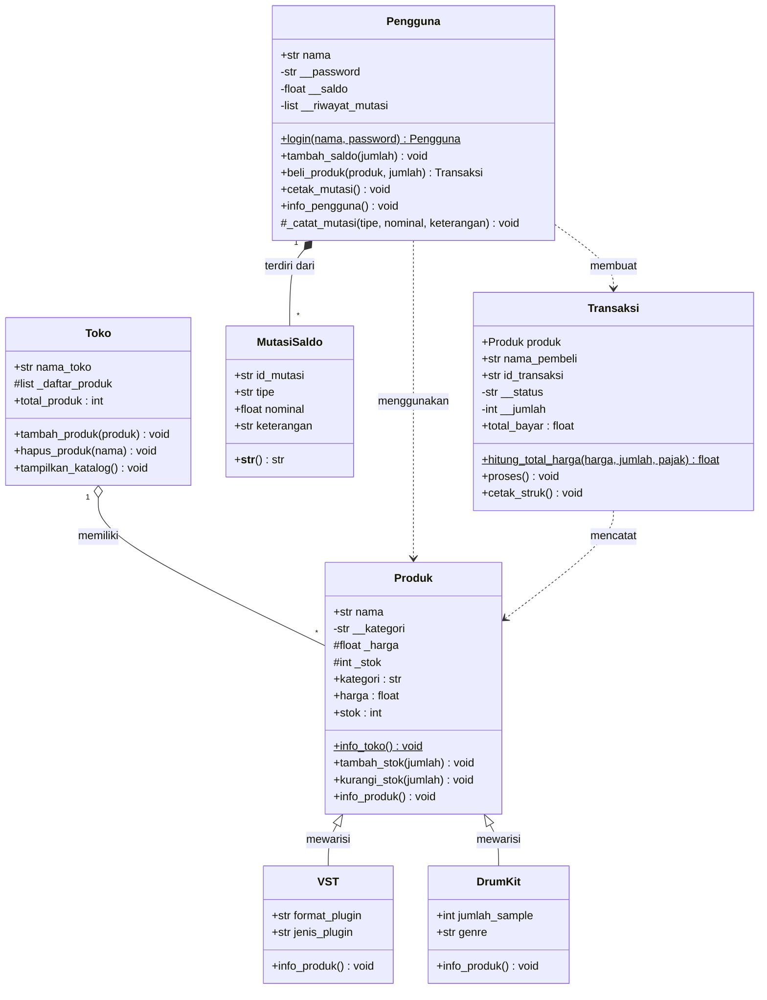

# SoundPlam: Sistem Manajemen Penjualan Plugin VST dan Drum Kit

| | |
|---|---|
| **Nama** | Muhamad Farid Al Mubarok |
| **NIM** | 2509106087 |
| **Kelas** | B2'25 |
| **Mata Kuliah** | Pemrograman Berorientasi Objek |

---

## 1. Deskripsi Program

SoundPlam adalah program simulasi toko digital yang menjual **Plugin VST** dan **Drum Kit**. Program mengelola produk beserta stoknya, akun pengguna beserta saldonya, dan transaksi pembelian yang menghitung total bayar (harga dikali jumlah ditambah pajak).

Program dibuat dengan pendekatan OOP dan memakai materi tiga modul:

| Modul | Materi | Penerapan di program |
|---|---|---|
| 1 | Class & Object | 3 class utama (`Produk`, `Transaksi`, `Pengguna`) dan minimal 2 objek tiap class |
| 2 | Atribut & Method | Atribut kelas, atribut instance, instance method, class method, static method |
| 3 | Encapsulation & Property | Atribut private (`__`), `@property`, `@nama.setter` dengan validasi |

Ketiga class **berdiri sendiri** (tanpa inheritance) dan saling berinteraksi lewat objek.

---

## 2. Struktur File

```
PostTest-1/
├── produk.py       # class Produk
├── transaksi.py    # class Transaksi (memakai objek Produk)
├── pengguna.py     # class Pengguna (memakai objek Produk dan Transaksi)
├── main.py         # demonstrasi dan pengujian program
└── README.md       # dokumentasi ini
```

---

## 3. Struktur Class

### 3.1 Class `Produk`

Merepresentasikan satu produk yang dijual, baik Plugin VST maupun Drum Kit.

**Atribut kelas** (dipakai bersama oleh semua objek)

| Atribut | Nilai awal | Fungsi |
|---|---|---|
| `nama_toko` | `"SoundPlam"` | Nama toko |
| `jumlah_produk` | `0` | Penghitung jumlah objek `Produk` yang dibuat |
| `kategori_produk` | `["VST Plugin", "Drum Kit"]` | Daftar kategori yang valid, dipakai untuk validasi |

**Atribut instance** (diisi lewat `__init__`, unik per objek)

| Atribut | Akses | Keterangan |
|---|---|---|
| `nama` | Public | Nama produk, contoh `"Serum"` |
| `__kategori` | Private | Diakses lewat property `kategori` |
| `__harga` | Private | Diakses lewat property `harga` |
| `__stok` | Private | Diakses lewat property `stok` |

**Property, getter dan setter** (nama getter dan setter sama)

| Property | Validasi di setter |
|---|---|
| `kategori` | Harus salah satu dari `kategori_produk` |
| `harga` | Harus angka (`int`/`float`) dan tidak boleh negatif |
| `stok` | Harus bilangan bulat (`int`) dan tidak boleh negatif |

**Method**

| Method | Jenis | Fungsi |
|---|---|---|
| `info_toko()` | Class method (`@classmethod`) | Menampilkan `nama_toko` dan `jumlah_produk` |
| `tambah_stok(jumlah)` | Instance method | Menambah stok, jumlah harus bilangan bulat lebih dari 0 |
| `kurangi_stok(jumlah)` | Instance method | Mengurangi stok, jumlah tidak boleh melebihi stok |
| `info_produk()` | Instance method | Menampilkan nama, kategori, harga, dan stok produk |

---

### 3.2 Class `Transaksi` (`transaksi.py`)

Merepresentasikan satu pembelian. Class ini **memakai objek `Produk`** untuk mengambil harga dan mengurangi stok.

**Atribut kelas**

| Atribut | Nilai awal | Fungsi |
|---|---|---|
| `pajak` | `0.11` | Tarif pajak 11% untuk transaksi baru |
| `jumlah_transaksi` | `0` | Penghitung semua objek `Transaksi` yang dibuat, dipakai untuk ID |
| `total_pendapatan` | `0` | Total uang masuk, bertambah hanya saat transaksi **berhasil** |
| `riwayat` | `[]` | Daftar objek transaksi yang berhasil |

**Atribut instance**

| Atribut | Akses | Keterangan |
|---|---|---|
| `produk` | Public | Objek `Produk` yang dibeli (bukti interaksi antar class) |
| `nama_pembeli` | Public | Nama pembeli untuk dicetak di struk |
| `harga_satuan` | Public | Salinan harga produk saat transaksi dibuat, supaya struk lama tidak berubah kalau harga produk diubah |
| `pajak_transaksi` | Public | Salinan tarif pajak saat transaksi dibuat |
| `id_transaksi` | Public | ID otomatis, contoh `SDP-1` |
| `__status` | Private | `"Pending"`, `"Berhasil"`, atau `"Gagal"` |
| `__jumlah` | Private | Jumlah unit yang dibeli |

**Property**

| Property | Setter | Keterangan |
|---|---|---|
| `jumlah` | Ada | Harus bilangan bulat lebih dari 0, dan hanya boleh diubah saat status `"Pending"` |
| `status` | Tidak ada | Nilainya diatur program, tidak boleh diubah dari luar |
| `total_bayar` | Tidak ada | Dihitung otomatis dari harga, jumlah, dan pajak, sehingga tidak bisa dimanipulasi |

**Method**

| Method | Jenis | Fungsi |
|---|---|---|
| `hitung_total_harga(harga_satuan, jumlah, pajak)` | Static method (`@staticmethod`) | Menghitung `subtotal + subtotal * pajak`, tanpa `self` maupun `cls` |
| `info_transaksi()` | Class method | Menampilkan jumlah transaksi dibuat, jumlah yang berhasil, dan total pendapatan |
| `proses()` | Instance method | Mengecek status dan stok, lalu mengurangi stok, mengubah status, dan mencatat ke `riwayat` |
| `cetak_struk()` | Instance method | Menampilkan rincian transaksi |

---

### 3.3 Class `Pengguna` (`pengguna.py`)

Merepresentasikan pembeli yang memiliki akun dan saldo.

**Atribut kelas**

| Atribut | Nilai awal | Fungsi |
|---|---|---|
| `jumlah_pengguna` | `0` | Penghitung jumlah objek `Pengguna` |
| `daftar_pengguna` | `[]` | Menyimpan semua objek pengguna, dipakai untuk login |

**Atribut instance**

| Atribut | Akses | Keterangan |
|---|---|---|
| `nama` | Public | Username |
| `__password` | Private | Diakses lewat property `password` |
| `__saldo` | Private | Diakses lewat property `saldo` |

**Property, getter dan setter**

| Property | Validasi di setter |
|---|---|
| `saldo` | Harus angka dan tidak boleh negatif |
| `password` | Harus teks dan minimal 6 karakter |

**Method**

| Method | Jenis | Fungsi |
|---|---|---|
| `login(nama, password)` | Class method | Mencari pengguna di `daftar_pengguna`, mengembalikan objeknya kalau cocok, atau `None` kalau gagal |
| `tambah_saldo(jumlah)` | Instance method | Menambah saldo, jumlah harus lebih dari 0 |
| `beli_produk(produk, jumlah)` | Instance method | Membuat `Transaksi`, mengecek saldo, memproses transaksi, lalu memotong saldo |
| `info_pengguna()` | Instance method | Menampilkan nama dan saldo |

---

### 3.4 Ringkasan Pemenuhan Syarat Tugas

| Syarat | Terpenuhi oleh |
|---|---|
| Minimal 3 class utama | `Produk`, `Transaksi`, `Pengguna` |
| Minimal 3 atribut kelas | Total 10 atribut kelas (3 di `Produk`, 4 di `Transaksi`, 2 di `Pengguna`, masing-masing class punya lebih dari 1) |
| Atribut instance lewat `__init__` | Semua class |
| Atribut public dan private | Public: `nama`, `produk`, `harga_satuan`, dll. Private: `__harga`, `__stok`, `__saldo`, `__password`, dll. |
| Instance method | `info_produk`, `tambah_stok`, `proses`, `beli_produk`, dll. |
| Class method | `info_toko`, `info_transaksi`, `login` |
| Static method | `hitung_total_harga` |
| `@property` dan `@nama.setter` bernama sama | `kategori`, `harga`, `stok`, `saldo`, `password`, `jumlah` |
| Setter dengan validasi | Semua setter di atas menolak data tidak valid |
| Interaksi antar class | `Transaksi` memakai `Produk`, `Pengguna` membuat `Transaksi` |

---

## 4. Aturan Validasi

Setter yang menerima data tidak valid akan **mencetak peringatan dan tidak mengubah nilai lama**.

| Class | Property | Aturan | Pesan jika ditolak |
|---|---|---|---|
| `Produk` | `harga` | Angka, tidak negatif | `Harga harus berupa angka` / `Harga tidak boleh negatif` |
| `Produk` | `stok` | Bilangan bulat, tidak negatif | `Stok harus berupa bilangan bulat` / `Stok tidak boleh negatif` |
| `Produk` | `kategori` | Ada di `kategori_produk` | `Kategori tidak valid...` |
| `Pengguna` | `saldo` | Angka, tidak negatif | `Saldo harus berupa angka` / `Saldo tidak boleh negatif` |
| `Pengguna` | `password` | Teks, minimal 6 karakter | `Password harus minimal 6 karakter` |
| `Transaksi` | `jumlah` | Bilangan bulat lebih dari 0, status `Pending` | `Jumlah harus lebih dari 0` / `Transaksi sudah diproses...` |

---

## 5. Pengembangan Program: UML Class Relationships dan Inheritance

Pada tahap ini program dikembangkan dengan dua materi baru, yaitu **UML Class Relationships** (Modul 4) dan **Inheritance** (Modul 5). Ketiga class sebelumnya (`Produk`, `Transaksi`, `Pengguna`) tetap dipakai, lalu ditambah empat class baru.

### 5.1 Class Baru

| Class | Jenis | Fungsi |
|---|---|---|
| `VST` | Subclass dari `Produk` | Produk berkategori Plugin VST, atribut unik: `format_plugin`, `jenis_plugin` |
| `DrumKit` | Subclass dari `Produk` | Produk berkategori Drum Kit, atribut unik: `jumlah_sample`, `genre` |
| `Toko` | Class penampung | Menampung daftar objek `Produk` (relasi **agregasi**) |
| `MutasiSaldo` | Class bagian | Catatan mutasi saldo milik `Pengguna` (relasi **komposisi**) |

### 5.2 Perubahan pada Class yang Sudah Ada

| Class | Perubahan | Alasan |
|---|---|---|
| `Produk` | `__harga` dan `__stok` diubah menjadi `_harga` dan `_stok` (protected) | Subclass perlu mengaksesnya langsung |
| `Produk` | `__kategori` tetap private | Data rahasia milik superclass, subclass hanya bisa membaca lewat property `kategori` |
| `Pengguna` | Menambah atribut private `__riwayat_mutasi`, method `_catat_mutasi()` dan `cetak_mutasi()` | Menerapkan relasi komposisi dengan `MutasiSaldo` |
| `Pengguna` | `tambah_saldo()` dan `beli_produk()` kini mencatat mutasi saldo | Setiap perubahan saldo tersimpan sebagai riwayat |
| `Pengguna` | Pengecekan saldo di `beli_produk()` dilakukan sebelum objek `Transaksi` dibuat | Pembelian yang gagal karena saldo kurang tidak lagi menambah penghitung `jumlah_transaksi` |

### 5.3 Struktur File

```
PostTest-2/
├── soundplam.py    # seluruh class dan demonstrasi program
└── README.md       # dokumentasi ini
```

---

## 6. Diagram UML



### 6.1 Notasi yang Dipakai

| Notasi | Arti | Contoh pada diagram |
|---|---|---|
| `<\|--` | Pewarisan (segitiga kosong di sisi superclass) | `Produk <\|-- VST` |
| `o--` | Agregasi (wajik kosong di sisi induk) | `Toko o-- Produk` |
| `*--` | Komposisi (wajik solid di sisi induk) | `Pengguna *-- MutasiSaldo` |
| `..>` | Asosiasi atau dependensi (panah putus-putus) | `Pengguna ..> Produk` |
| `+` | Public | `+nama` |
| `#` | Protected | `#_harga`, `#_stok` |
| `-` | Private | `-__kategori`, `-__saldo` |
| `$` | Static atau class method | `info_toko()`, `login()` |
| `1`, `*` | Multiplisitas: tepat satu, nol atau lebih | `Toko "1" o-- "*" Produk` |

### 6.2 Cara Membaca Diagram

| Relasi | Dibaca |
|---|---|
| `Produk <\|-- VST` dan `Produk <\|-- DrumKit` | `VST` adalah jenis `Produk`, dan `DrumKit` adalah jenis `Produk` (pewarisan) |
| `Toko "1" o-- "*" Produk` | Satu `Toko` memiliki banyak `Produk` (agregasi) |
| `Pengguna "1" *-- "*" MutasiSaldo` | Satu `Pengguna` terdiri dari banyak `MutasiSaldo` (komposisi) |
| `Pengguna ..> Produk` | `Pengguna` menggunakan `Produk` lewat parameter method (asosiasi) |
| `Pengguna ..> Transaksi` | `Pengguna` membuat `Transaksi` saat membeli produk |
| `Transaksi ..> Produk` | `Transaksi` mencatat produk yang dibeli |

---

## 7. Penerapan UML Class Relationships

### 7.1 Asosiasi: `Pengguna` menggunakan `Produk`

Objek `Produk` **tidak disimpan** sebagai atribut tetap di dalam `Pengguna`. Objek itu hanya diterima lewat parameter method `beli_produk()` dan dipakai sesaat. Keduanya hidup mandiri.

```python
def beli_produk(self, produk, jumlah):
    if not isinstance(produk, Produk):
        raise ValueError("[!] Error: Produk tidak valid")
    ...
    transaksi = Transaksi(produk, jumlah, self.nama)
    transaksi.proses()
```

Karena `isinstance(produk, Produk)` juga bernilai `True` untuk `VST` dan `DrumKit`, method yang sama bisa menerima kedua jenis produk.

### 7.2 Agregasi: `Toko` memiliki `Produk`

Objek `Produk` **dibuat di luar** `Toko`, lalu didaftarkan ke list `_daftar_produk`. Yang disimpan hanya referensi, sehingga jika `Toko` dihapus, `Produk` tetap ada.

```python
class Toko:
    def __init__(self, nama_toko):
        self.nama_toko = nama_toko
        self._daftar_produk = []

    def tambah_produk(self, produk):
        if not isinstance(produk, Produk):
            raise ValueError("[!] Error: Produk tidak valid")
        self._daftar_produk.append(produk)
```

```python
serum = VST("Wavetable Synth X", 1500000, 10, "VST3", "Synthesizer")
toko = Toko("SoundPlam")
toko.tambah_produk(serum)
del toko
print(serum.nama)
```

### 7.3 Komposisi: `Pengguna` terdiri dari `MutasiSaldo`

Objek `MutasiSaldo` **dibuat langsung di dalam** `Pengguna` lewat method `_catat_mutasi()` dan disimpan di list private `__riwayat_mutasi`. Objek ini tidak dibuat dari luar, tidak dibagi ke objek lain, dan tidak punya arti tanpa pemilik akunnya.

```python
def _catat_mutasi(self, tipe, nominal, keterangan):
    id_baru = f"MUT-{len(self.__riwayat_mutasi) + 1:04d}"
    self.__riwayat_mutasi.append(MutasiSaldo(id_baru, tipe, nominal, keterangan))
```

### 7.4 Perbandingan Ketiga Relasi pada Program

| Aspek | Asosiasi | Agregasi | Komposisi |
|---|---|---|---|
| Class yang terlibat | `Pengguna` dan `Produk` | `Toko` dan `Produk` | `Pengguna` dan `MutasiSaldo` |
| Kata kunci | "menggunakan" | "memiliki" | "terdiri dari" |
| Notasi UML | `..>` | `o--` | `*--` |
| Lokasi pembuatan objek bagian | Di luar, dikirim lewat parameter | Di luar, dikirim ke penampung (list) | Di dalam objek induk |
| Disimpan sebagai atribut? | Tidak | Ya, berupa referensi | Ya, dimiliki penuh |
| Jika objek induk dihapus | Objek yang dipakai tetap ada | Anggota tetap ada | Objek bagian ikut musnah |

---

## 8. Penerapan Inheritance

### 8.1 Hierarki Pewarisan

```
Produk              (superclass)
├── VST             (subclass 1)
└── DrumKit         (subclass 2)
```

Tipe inheritance yang dipakai adalah **hierarchical inheritance**, yaitu satu superclass (`Produk`) diwarisi oleh dua subclass (`VST` dan `DrumKit`). Uji **is-a** masuk akal untuk keduanya:

| Pernyataan | Hasil | Relasi yang tepat |
|---|---|---|
| VST adalah Produk | Benar | Inheritance |
| DrumKit adalah Produk | Benar | Inheritance |
| Toko adalah Produk | Salah | Toko memiliki Produk (Agregasi) |
| MutasiSaldo adalah Pengguna | Salah | Pengguna terdiri dari MutasiSaldo (Komposisi) |

### 8.2 Superclass `Produk`

Atribut dan method milik `Produk` otomatis diwarisi oleh `VST` dan `DrumKit`.

| Atribut | Akses | Keterangan |
|---|---|---|
| `nama` | Public | Nama produk |
| `__kategori` | **Private** | Rahasia milik `Produk`, subclass hanya bisa membaca lewat property `kategori` |
| `_harga` | **Protected** | Boleh diakses langsung oleh subclass |
| `_stok` | **Protected** | Boleh diakses langsung oleh subclass |

### 8.3 Subclass `VST`

| Atribut unik | Keterangan |
|---|---|
| `format_plugin` | Format plugin, contoh `"VST3"` |
| `jenis_plugin` | Jenis plugin, contoh `"Synthesizer"` atau `"Effect"` |

Kategori tidak diminta dari pengguna, tetapi langsung diisi `"VST Plugin"` sehingga tidak mungkin salah input.

### 8.4 Subclass `DrumKit`

| Atribut unik | Keterangan |
|---|---|
| `jumlah_sample` | Jumlah file sample dalam kit |
| `genre` | Genre kit, contoh `"Trap"` |

Kategori langsung diisi `"Drum Kit"`.

### 8.5 Penggunaan `super().__init__()`

Subclass memanggil konstruktor superclass untuk mengisi atribut bawaan (`nama`, `_harga`, `_stok`, dan `__kategori`), lalu hanya mengisi atribut miliknya sendiri.

```python
class VST(Produk):
    def __init__(self, nama, harga, stok, format_plugin, jenis_plugin):
        super().__init__(nama, "VST Plugin", harga, stok)
        self.format_plugin = format_plugin
        self.jenis_plugin = jenis_plugin


class DrumKit(Produk):
    def __init__(self, nama, harga, stok, jumlah_sample, genre):
        super().__init__(nama, "Drum Kit", harga, stok)
        self.jumlah_sample = jumlah_sample
        self.genre = genre
```

### 8.6 Method Overriding

Method `info_produk()` milik `Produk` didefinisikan ulang di kedua subclass. Keduanya memanggil `super().info_produk()` lebih dulu agar tidak menulis ulang kode cetak nama, kategori, harga, dan stok, lalu menambahkan perilaku berbeda.

| Class | Perilaku tambahan pada `info_produk()` |
|---|---|
| `Produk` | Mencetak nama, kategori, harga, dan stok |
| `VST` | Ditambah format, jenis, dan **status lisensi** (`Habis` jika stok 0, `Hampir habis` jika stok 5 ke bawah, selain itu `Tersedia`) |
| `DrumKit` | Ditambah jumlah sample, genre, dan **harga per sample** (`_harga / jumlah_sample`) |

```python
class VST(Produk):
    def info_produk(self):
        super().info_produk()
        status = "Habis" if self._stok == 0 else ("Hampir habis" if self._stok <= 5 else "Tersedia")
        print(f"    Format   : {self.format_plugin}")
        print(f"    Jenis    : {self.jenis_plugin}")
        print(f"    Lisensi  : {status}")


class DrumKit(Produk):
    def info_produk(self):
        super().info_produk()
        harga_per_sample = self._harga / self.jumlah_sample
        print(f"    Sample   : {self.jumlah_sample} file")
        print(f"    Genre    : {self.genre}")
        print(f"    Per sample: Rp{harga_per_sample:,.0f}")
```

### 8.7 Tingkat Akses pada Pewarisan (Protected dan Private)

| Tingkat | Atribut | Dipakai oleh | Alasan |
|---|---|---|---|
| Protected (`_`) | `_harga`, `_stok` | `Produk`, `VST`, `DrumKit` | Subclass membutuhkan nilai ini langsung (`_stok` untuk status lisensi, `_harga` untuk harga per sample) |
| Private (`__`) | `__kategori` | Hanya `Produk` | Data rahasia superclass, tidak boleh diubah sembarangan oleh subclass |

Atribut private mengalami *name mangling*: di dalam `VST`, penulisan `self.__kategori` akan dibaca Python sebagai `_VST__kategori` dan tidak ditemukan, sehingga memicu `AttributeError`. Itulah sebabnya atribut yang memang perlu dipakai subclass dibuat protected, sedangkan yang benar-benar rahasia dibuat private.


### 8.8 Ringkasan Pemenuhan Syarat Inheritance

| Syarat | Terpenuhi oleh |
|---|---|
| Minimal 1 superclass dan 2 subclass | Superclass `Produk`, subclass `VST` dan `DrumKit` |
| Subclass memanggil `super().__init__(...)` | `VST` dan `DrumKit` |
| Tiap subclass punya atribut unik | `VST`: `format_plugin`, `jenis_plugin`. `DrumKit`: `jumlah_sample`, `genre` |
| Minimal 1 method di-override | `info_produk()` di `VST` dan `DrumKit` |
| Protected untuk data yang diakses subclass | `_harga`, `_stok` |
| Private untuk data rahasia superclass | `__kategori` |

### 8.9 Ringkasan Pemenuhan Syarat UML Class Relationships

| Syarat | Terpenuhi oleh |
|---|---|
| Asosiasi | `Pengguna.beli_produk(produk, jumlah)` menerima `Produk` lewat parameter |
| Agregasi | `Toko` menampung `Produk` yang dibuat di luar |
| Komposisi | `Pengguna` membuat `MutasiSaldo` di dalam dirinya sendiri |

---

## 9. Panduan Pengujian

Pengujian dilakukan lewat blok `if __name__ == "__main__":` di bagian bawah `soundplam.py`. Jalankan `python soundplam.py`, lalu cocokkan hasilnya dengan tabel di bawah.

### Data awal

| Objek | Data |
|---|---|
| `serum` (VST) | Wavetable Synth X, Rp1.500.000, stok 10, format VST3, jenis Synthesizer |
| `reverb` (VST) | Hall Reverb Pro, Rp800.000, stok 3, format VST3, jenis Effect |
| `trap` (DrumKit) | Trap Essentials, Rp250.000, stok 20, 120 sample, genre Trap |
| `toko` (Toko) | Toko bernama SoundPlam |
| `budi` (Pengguna) | password `rahasia123`, saldo Rp5.000.000 |

### Langkah pengujian

**Pengujian 1: Agregasi (`Toko` menampung `Produk`)**
Membuat `serum`, `reverb`, dan `trap` di luar, lalu memanggil `toko.tambah_produk()` untuk masing-masing, kemudian `toko.tampilkan_katalog()`.
Hasil yang diharapkan: tercetak tiga pesan `[+] ... dijual di SoundPlam` dan katalog `SoundPlam (3 produk)`.

**Pengujian 2: Method overriding (`info_produk()` berbeda per subclass)**

| Objek | Informasi tambahan yang diharapkan |
|---|---|
| `serum` (VST) | `Format: VST3`, `Jenis: Synthesizer`, `Lisensi: Tersedia` |
| `reverb` (VST) | `Format: VST3`, `Jenis: Effect`, `Lisensi: Hampir habis` (stok 3) |
| `trap` (DrumKit) | `Sample: 120 file`, `Genre: Trap`, `Per sample: Rp2,083` |

**Pengujian 3: Asosiasi (`Pengguna.beli_produk()`)**

| Aksi | Hasil yang diharapkan |
|---|---|
| `budi.beli_produk(serum, 1)` | Struk `SDP-1`, total Rp1.665.000, status `Berhasil`, stok `serum` 10 menjadi 9 |
| `budi.beli_produk(trap, 2)` | Struk `SDP-2`, total Rp555.000, status `Berhasil`, stok `trap` 20 menjadi 18 |

Pembelian berjalan untuk `VST` maupun `DrumKit` memakai method yang sama.

**Pengujian 4: Komposisi (`MutasiSaldo` di dalam `Pengguna`)**
`budi.tambah_saldo(1000000)` lalu `budi.cetak_mutasi()`.
Hasil yang diharapkan: saldo akhir Rp3.780.000 dan empat mutasi:

```
[MUT-0001] KREDIT +Rp5,000,000 | Ket: Saldo awal akun
[MUT-0002] DEBET  -Rp1,665,000 | Ket: Beli Wavetable Synth X (SDP-1)
[MUT-0003] DEBET  -Rp555,000 | Ket: Beli Trap Essentials (SDP-2)
[MUT-0004] KREDIT +Rp1,000,000 | Ket: Top up saldo
```

**Pengujian 5: Cek pewarisan**

| Pemanggilan | Hasil yang diharapkan |
|---|---|
| `isinstance(serum, Produk)` | `True` (VST adalah Produk) |
| `isinstance(serum, DrumKit)` | `False` (VST bukan DrumKit) |
| `issubclass(DrumKit, Produk)` | `True` |

**Pengujian 6: Bukti siklus hidup agregasi**
`del toko`.
Hasil yang diharapkan: `serum`, `reverb`, dan `trap` tetap bisa diakses.

**Pengujian 7: Validasi error**
`budi.beli_produk(reverb, 99)` (stok hanya 3).
Hasil yang diharapkan: `[!] Error: Stok tidak cukup (sisa 3)`.

**Pengujian 8: Class method `info_toko()` dan `info_transaksi()`**
Hasil yang diharapkan:

```
Nama Toko: SoundPlam
Jumlah Produk: 3
Transaksi dibuat     : 2
Transaksi berhasil   : 2
Total pendapatan     : Rp2,220,000
```

### Cakupan pengujian terhadap syarat tugas

| Yang diuji | Pengujian |
|---|---|
| Asosiasi | 3 |
| Agregasi | 1, 6 |
| Komposisi | 4 |
| Superclass dan 2 subclass | 1, 2, 5 |
| `super().__init__()` | 1 (pembuatan objek `VST` dan `DrumKit`) |
| Atribut unik subclass | 2 |
| Method overriding | 2 |
| Protected dan private | 2 (`_stok` dan `_harga` terbaca di subclass), 4 (`__riwayat_mutasi` lewat `cetak_mutasi()`) |

---
